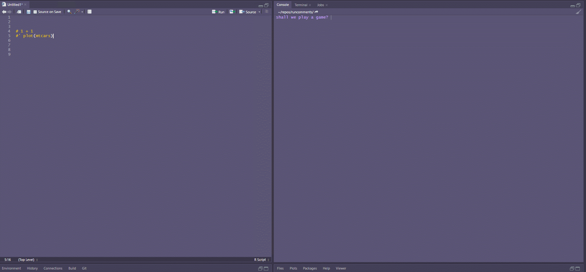
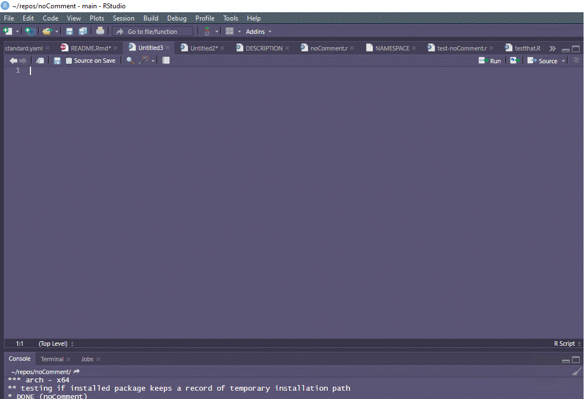

<!-- README.md is generated from README.Rmd. Please edit that file -->

```{r, include = FALSE}
knitr::opts_chunk$set(
  collapse = TRUE,
  comment = "#>",
  fig.path = "man/figures/README-",
  out.width = "100%"
)
```

# noComment

<!-- badges: start -->

<!-- badges: end -->

Sometimes you just want to run a block (multiple lines) code you've commented out.

Do you
<ol type="a">
<li>Temporarily uncomment the code? Don't forget to recomment it when you're done. Hint: you probably will.</li>
<li>Copy and paste to a new .R file.? More untitleds for untitled gods!</li>
<li><b>Select your lines and use noComment addin assigned to a keyboard shortcut. I am trialling Ctrl + '</b></li>
</ol>

Also works great for interactively running examples in roxygen markup!

## Here's how

1. Select multiple lines of commented code in the source pane (or don't to run the line your cursor is currently on).
1. Use the shortcut or go to Addins | Run commented source lines 
1. Your selected lines will be stripped of comment symbols and run in the console.



## Installation

You can install the development version of nocomment from [github](https://github.com) with:

``` r
remotes::install_github("adam-gruer/noComment")

```

## Setup

Restart R after installing the package.

Assign a keyboard shortcut to the Run commented source lines addin e.g Ctrl + '
 

## Customize

Is noComment not stripping out all your weird and wonderful commenting markup? Hey, you do you!
noComment uses this regex `"^\\s*#+\\s*'*"` to strip put comment symbols from the start of lines, mainly # #' and any spaces.
If you have improvements to this let me know in an issue. But also you can use your own by setting the noComment.regex option to whatever regular expression you desire like so (note, example is not a real regex)

```
options(noComment.regex = "^\\\\\\\\\\\\\\\\\\\\s()+[1-9]*")
```


 


